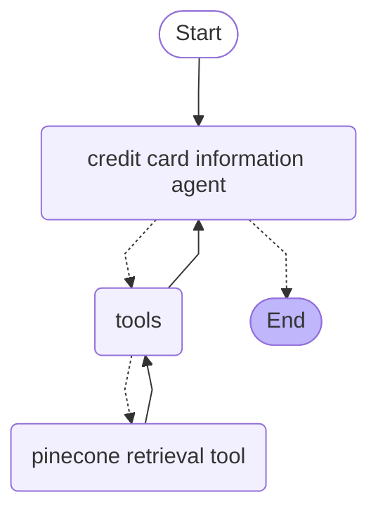
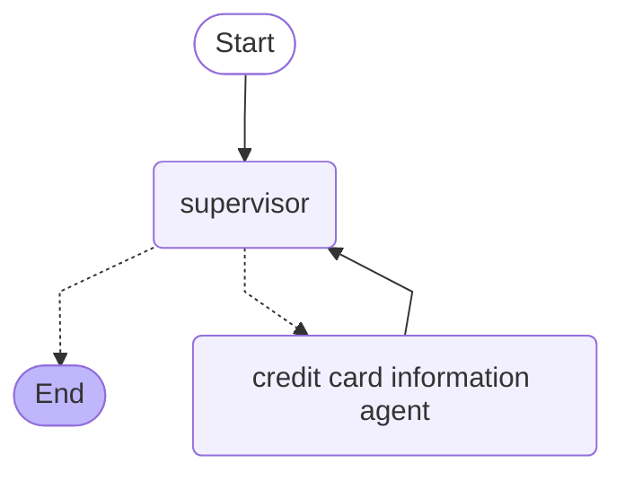

# Galileo LangGraph multi-agent demo

This demo app shows how to configure Galileo to monitor and evaluate a multi-agent app built using LangGraph.


## Overview of this app

This app is a chatbot for the fictional financial services company, Brahe Bank. You can use the bot to ask about:

- Information on the current credit card offers, and their terms and conditions
- More coming soon!

### Tech stack

This app uses:

- LangGraph to orchestrate agents
- Chainlit to provide a UI
- Pinecone as a vector database

### Agents

This app has a number of agents, orchestrated by a supervisor agent.

#### Credit card information agent

This agent provides information on the available credit cards.



#### Supervisor agent



## Setup

To run the app, you need the following:

- [A Galileo account](https://app.galileo.ai/sign-up), with a project created
- [A Pinecone account](https://www.pinecone.io)
- [An OpenAI API Key](https://platform.openai.com/api-keys)

### Configure the app

1. Copy the `.env.example` file to `.env`
1. Fill in the values

    For the Galileo values, you MUST create the project up front, but the log stream does not need to be created, it will be created automatically

### Install the dependencies

You can install the dependencies into a virtual environment using `uv`.

```bash
uv sync --dev
```

### Upload data to Pinecone

Pinecone is used to store documents that different agents can use. There is a helper script to create indexes and upload the documents.

```bash
python ./scripts/setup_pinecone.py
```

This will take a few seconds and a successful run should look like:

```text
Loading documents for credit-card-information folder...
...
✅ Document processing and upload complete!
```

### Launch the app

To launch the app, you can use the `chainlit` package that you just installed:

```bash
chainlit run app.py -w
```

This will start the app, and launch it on [localhost:8000](http://localhost:8000). The `-w` flag will watch for code changes, and reload if these are made, so you avoid restarting the app if you make code changes.

This project also includes a `launch.json` configured to debug the app in VS Code.

## Evaluate the agents

Once you have interacted with the app, traces will appear in Galileo. Log into the [Galileo console](https://app.galileo.ai), and you will see your traces.

From there you can configure the metrics you are interested in. Once metrics are enabled, you can have more conversations to see the evaluations.
