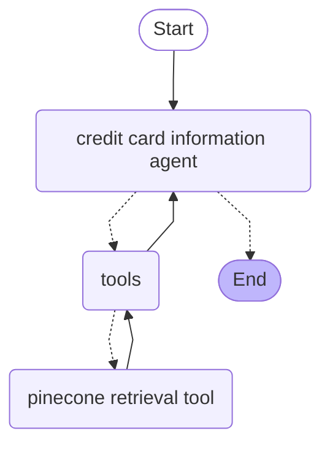
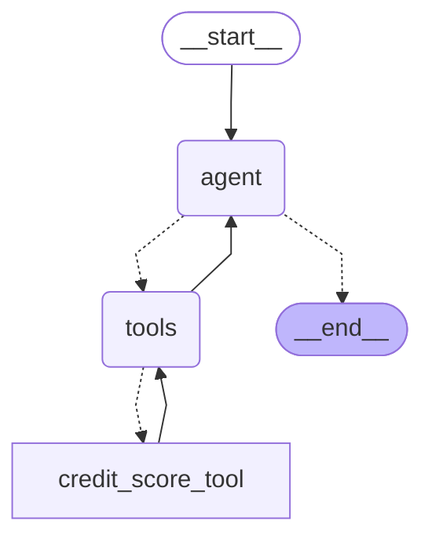
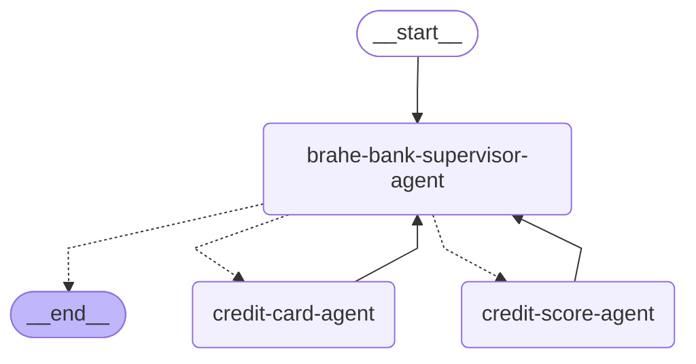

# Galileo LangGraph multi-agent demo

This demo app shows how to configure Galileo to monitor and evaluate a multi-agent app built using LangGraph.

## Overview of this app

This app is a chatbot for the fictional financial services company, Brahe Bank. You can use the bot to ask about:

- Information on the current credit card offers, and their terms and conditions
- Information on your credit score (this is hard coded to 550)
- More coming soon!

### Tech stack

This app uses:

- LangGraph to orchestrate agents
- Pinecone as a vector database

### Agents

This app has a number of agents, orchestrated by a supervisor agent.

#### Credit card information agent

This agent provides information on the available credit cards.



#### Credit score agent

This agent provides information on a hard coded credit score, with is high enough for the Orbit credit card, but not enough for the Celestial credit card.



#### Supervisor agent



## Setup

To run the app, you need the following:

- [A Galileo account](https://app.galileo.ai/sign-up), with a project created
- [A Pinecone account](https://www.pinecone.io)
- [An OpenAI API Key](https://platform.openai.com/api-keys)

### Configure the app

1. Copy the `.env.example` file to `.env`
1. Fill in the values

    For the Galileo values, you MUST create the project up front, but the log stream does not need to be created, it will be created automatically

### Install the dependencies

You can install the dependencies into a virtual environment using `uv`.

```bash
uv sync --dev
```

### Upload data to Pinecone

Pinecone is used to store documents that different agents can use. There is a helper script to create indexes and upload the documents.

```bash
npm run upload-docs
```

This will take a few seconds and a successful run should look like:

```text
Loading documents for credit-card-information folder...
...
✅ Document processing and upload complete!
```

### Launch the app

The app runs as a simple terminal chatbot.

1. Install the dependencies:

    ```bash
    npm i
    ```

1. Run the app

    ```bash
    npm run start
    ```

You can then chat with the terminal:

```output
Session started.
You: What credit cards do you offer?
Assistant: Brahe Bank offers the Orbit Basic Credit Card, which features no annual fee, a 29.9% APR on purchases, 34.9% APR on cash advances, and 0% APR on balance transfers for 12 months. It has standard fraud protection, contactless payment, and digital card management tools. This card is designed for simplicity and flexibility without a rewards program. Eligibility requires being 18 or older, with a valid U.S. mailing address and Social Security number, and a fair credit history.

If you would like more information or details about other credit card options, please let me know!
```

## Evaluate the agents

Once you have interacted with the app, traces will appear in Galileo. Log into the [Galileo console](https://app.galileo.ai), and you will see your traces.

From there you can configure the metrics you are interested in. Once metrics are enabled, you can have more conversations to see the evaluations.

## Evaluate the agents with a unit test

This project also includes a unit test to run the chatbot with a set of defined prompts, evaluating the prompts for action advancement, action completion, tool selection quality, and tool errors, only passing the test if both metrics score an average of 100% (or 0% for tool errors) over all the entries in the dataset.

This is run using the [Galileo experiments framework](https://v2docs.galileo.ai/concepts/experiments/overview) - allowing you to run any code as an experiment against a fixed dataset of prompts. This mechanism allows you to run AI applications, from simple to complex, under test conditions with a defined set of inputs. You can then use the results of evaluations run against your app to help with model selection or prompt engineering, as well as validating your application as part of a CI/CD pipeline.

You can run the unit test by running the following command inside your virtual environment:

```bash
npm test
```

This will run the single test which will:

- Look in your project for a dataset, creating it if it doesn't exist
- Call the agent inside a call to `run_experiment`, passing each row from the dataset in as inputs
- Poll the experiment until it has finished and the metrics are calculated
- Check that all the metrics return 100% (or 0% for tool errors), failing if they do not

To see the benefits of this unit test, after running it, check the insights in Galileo to fix up the agent system prompts. For example, the system prompt for the supervisor agent doesn't suggest using the credit score tool to answer questions on credit score.
