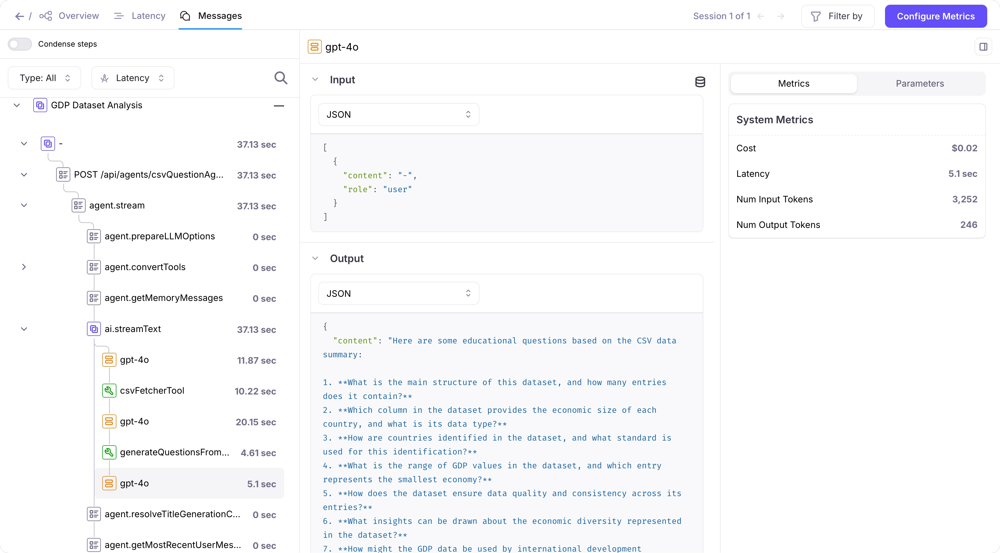

# Add Galileo to your Mastra project

This example shows how to add Galileo to a [Mastra project](https://mastra.ai/) using OTel.

This is based of the [Mastra CSV to Questions Generator sample app](https://github.com/mastra-ai/template-csv-to-questions).

## Setup

To run the app, you need the following:

- [A Galileo account](https://app.galileo.ai/sign-up), with a project created
- [An OpenAI API Key](https://platform.openai.com/api-keys)

### Configure the app

1. Copy the `.env.example` file to `.env`
1. Fill in the values

    For the Galileo values, you MUST create the project and Log stream, up front
  
### Install the dependencies

1. Install the dependencies using `npm`:

    ```bash
    npm install
    ```

### Launch the app

1. Launch the app using `npm`:

    ```bash
    npm run dev
    ```

  The app will launch and start a local web server, running by default on port 4111. Open this to see the app in action.

    ```output
    ➜  npm run dev

    > template-csv-to-questions@1.0.0 dev
    > mastra dev

    INFO [2025-08-20 16:55:08.233 -0700] (Mastra CLI): Starting watcher...
    INFO [2025-08-20 16:55:08.520 -0700] (Mastra CLI): Bundling finished, starting server...
    INFO [2025-08-20 16:55:08.527 -0700] (Mastra CLI): [Mastra Dev] - Starting server...
    Starting Mastra...
    INFO [2025-08-20 16:55:08.974 -0700] (Mastra):  Mastra API running on port http://localhost:4111/api
    INFO [2025-08-20 16:55:08.976 -0700] (Mastra): 👨‍💻 Playground available at http://localhost:4111
    ```

1. Select the agent you want to use

1. Ask the agent questions. These agents can handle CSV files, so you can ask questions like "Summarize the CSV file at https://raw.githubusercontent.com/plotly/datasets/master/2014_world_gdp_with_codes.csv"

    For testing, you can use these public CSV files:

    - World GDP Data: `https://raw.githubusercontent.com/plotly/datasets/master/2014_world_gdp_with_codes.csv`
    - Cities Data: `https://people.sc.fsu.edu/~jburkardt/data/csv/cities.csv`
    - Sample Dataset: `https://raw.githubusercontent.com/holtzy/data_to_viz/master/Example_dataset/1_OneNum.csv`

1. Navigate to your Galileo console. You will be able to see the conversation logged:

    

## Add Galileo to your own Mastra app

You can add Galileo to your own Mastra app using Otel.

1. Install OpenInference

    Install the OpenInference package in your project:

    ```bash
    npm install @arizeai/openinference-mastra
    ```

2. Configure Galileo in your Mastra project

  In your app definition you will need to add the following config:

  ```typescript
  ...
  import {
    OpenInferenceOTLPTraceExporter,
    isOpenInferenceSpan,
  } from "@arizeai/openinference-mastra";

  export const mastra = new Mastra({
    ...,
    telemetry: {
      serviceName: "openinference-mastra-agent",
      enabled: true,
      sampling: {
        type: "always_on",
      },
      export: {
        type: "custom",
        exporter: new OpenInferenceOTLPTraceExporter({
          url: env.GALILEO_CONSOLE_URL,
          headers: {
            "Galileo-API-Key": env.GALILEO_API_KEY ?? "your-galileo-api-key",
            "project": env.GALILEO_PROJECT ?? "your-galileo-project",
            "logstream": env.GALILEO_LOG_STREAM ?? "default",
          },
          spanFilter: isOpenInferenceSpan,
        }),
      },
    },
  })
  ```
